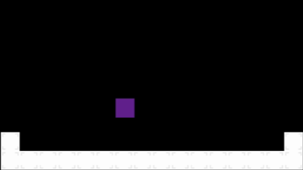

# 🐢 Blue Chell Mechanic Game

This project is inspired by the Blue Shell mechanic from *New Super Mario Bros.*, where the player character transforms into a shell that moves forward automatically, regardless of the player's direct action.  
The goal is to recreate this mechanic in a new game, offering a fun and unique gameplay experience.

---

## 🎮 Gameplay Preview

  
*GIF showing the shell mechanic in action.*

---

## 💻 Technology Stack

- **Engine:** GameMaker
- **Language:** GML
- **Target Platform:** Windows / Web

---

## License

This project is licensed under the [MIT License](LICENSE).

© 2025 **Blue Chell Dev Team**
